# CS 104: Introduction to Programming – Reimagined Curriculum (7 Weeks)

## �� Week 1: Basic Computer & Terminal Skills
- Lesson 1.1: What is a Computer? (Intro + Desktop Navigation)
- Lesson 1.2: Opening the Terminal (Mac + PowerShell)
- Lesson 1.3: Making Folders and Files in Terminal
- Lesson 1.4: Writing Your First File with Notepad/EditPad via Terminal
- Lesson 1.5: Reading and Editing Text Files via Terminal

## 🔁 Week 2: Understanding Git (Local Use Only)
- Lesson 2.1: What is Git? Why Use It?
- Lesson 2.2: Installing Git (Windows/Mac)
- Lesson 2.3: Git init, status, add, commit (Local-only workflow)
- Lesson 2.4: Using Git to Track Changes in Simple Text Files
- Lesson 2.5: Writing Commit Messages (Why They Matter)
- Lesson 2.6: Practice: Track a Text Journal with Git

## 🌐 Week 3: GitHub and Cloud Syncing
- Lesson 3.1: Creating a GitHub Account
- Lesson 3.2: SSH Keys vs HTTPS (Intro + Simplified)
- Lesson 3.3: Cloning from GitHub Classroom (Step-by-step)
- Lesson 3.4: Pushing Local Repos to GitHub
- Lesson 3.5: GitHub Pages and Repo Structure
- Lesson 3.6: Practice Assignment via GitHub Classroom

## 🐍 Week 4: Intro to Python Programming
- Lesson 4.1: Installing Python + VS Code
- Lesson 4.2: Running Python in Terminal
- Lesson 4.3: Writing Python with Print + Input
- Lesson 4.4: Variables and Strings
- Lesson 4.5: Writing and Running Tests Manually
- Lesson 4.6: Simple TDD with `assert`

## 🔣 Week 5: Building Programs with Logic
- Lesson 5.1: If/Else Statements
- Lesson 5.2: Boolean Expressions
- Lesson 5.3: Loops (For + While)
- Lesson 5.4: Lists and Dictionaries
- Lesson 5.5: Writing Pytest Files by Hand
- Lesson 5.6: Practice Project: Mini Quiz Game with Test File

## 📡 Week 6: Real World Data and APIs
- Lesson 6.1: What is an API? (With Examples)
- Lesson 6.2: JSON Files and How to Read Them
- Lesson 6.3: Writing Code to Parse JSON (List of Dicts)
- Lesson 6.4: Using `requests` to Call APIs
- Lesson 6.5: Displaying API Results with Python
- Lesson 6.6: Practice: Joke Fetcher App

## 🧪 Week 7: Final Project & Automation
- Lesson 7.1: Introduction to Flask (Simple Web Server)
- Lesson 7.2: Creating a Mini REST API
- Lesson 7.3: Creating GitHub Actions for Testing
- Lesson 7.4: Final Project: Submit + Sync + Test in GitHub
- Lesson 7.5: Demo and Reflection

## 📎 Appendices
- Appendix A: Common Git Commands Cheat Sheet
- Appendix B: Terminal Navigation Guide
- Appendix C: Sample GitHub Action for Pytest
- Appendix D: Glossary of Terms with Visuals

# CS 104: Introduction to Programming

## Week 1: Basic Computer & Terminal Skills

### Lesson 1.1: What is a Computer?

**Background:** A computer is a machine that can follow instructions to do work, play games, write, and talk to others. Important computer parts:

- CPU (brain): does the thinking.
- Memory (RAM): remembers things while you work.
- Storage: saves files and programs long term.
- Input devices: mouse, keyboard.
- Output devices: screen, speakers.
- Software: instructions and programs.
- Operating System (Windows/Mac): helps you use the computer, organize files, run programs, and talk to other devices.

**Diagram:**

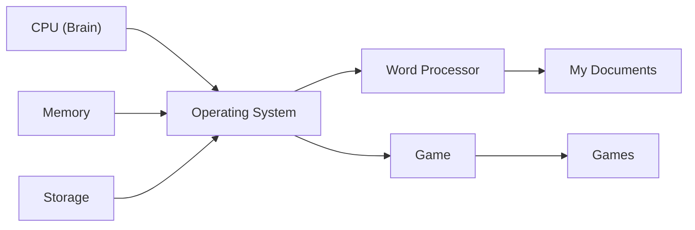

**Try it! Activity:**

- Open File Explorer (Windows) or Finder (Mac).
- Find Documents or Home folder.
- Make a folder called CS104.
- Create a note called `lesson1.txt` saying what you did. (Optional: screenshot)

---

### Lesson 1.2: What is an Operating System? How Does It Organize Files?

**Background:** The operating system is the main software that organizes your files and lets you run programs. Files are saved inside folders. Folders can be inside other folders (this is called a "tree").

**Diagram:**

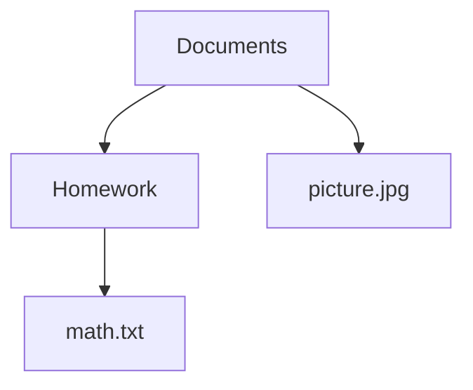

**Try it! Activity:**

- Go to your Documents folder.
- Make a folder named Homework.
- Inside Homework, make another folder called Math.
- In Math, create a text file called `lesson2.txt`.
- Write: “This is my first file in CS104.”
- Push `lesson2.txt` to your repo.

---

### Lesson 1.3: What is a Terminal? Why Use It?

**Background:** The terminal is a window where you type commands instead of clicking. It lets you talk directly to the computer to make or move files quickly. “Command” means something you type to tell the computer what to do.

**Diagram:**

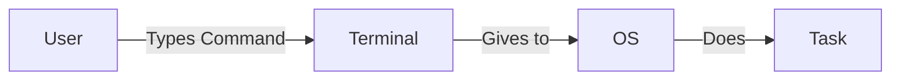

**Try it! Activity:**

- Open PowerShell (Windows) or Terminal (Mac).
- Type: `whoami` and press Enter.
- Type: `ls` (Mac) or `dir` (Windows) and press Enter.
- Create `lesson3.txt` with your username in it. Push to your repo.

---

### Lesson 1.4: How Do I Make Folders and Files in Terminal?

**Background:** You can use the terminal to make folders and files. This is fast and good for programming.

- To make a folder: `mkdir practice1`
- To enter the folder: `cd practice1`
- To make a file: `New-Item hello.txt` (Windows) or `touch hello.txt` (Mac)

**Diagram:**

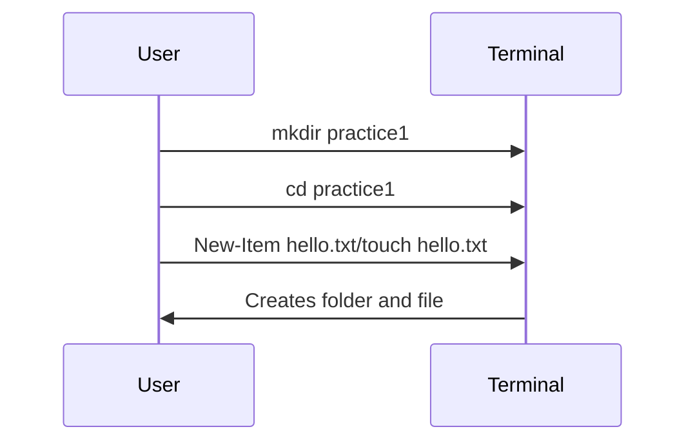

**Try it! Activity:**

- Make a folder called practice1 in your CS104 folder.
- Go into the folder.
- Make a file called hello.txt.
- Write “I made this file with the terminal!” inside hello.txt.
- Push hello.txt to your repo.

---

### Lesson 1.5: How Can I View and Edit Files from the Terminal?

**Background:** You can open, read, and change files using the terminal.

- Open a file: `notepad hello.txt` (Windows), `open -e hello.txt` (Mac)
- Read a file: `type hello.txt` (Windows), `cat hello.txt` (Mac)

**Diagram:**

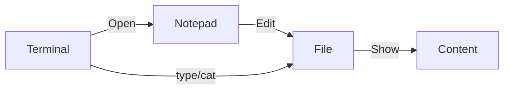

**Try it! Activity:**

- Open hello.txt in Notepad or EditPad from the terminal.
- Add a new line: “This is my second edit.”
- Save and close.
- Show the file in the terminal with type/cat.
- Push the updated file to your repo with a clear commit message.

---

## Week 2: Understanding Git (Local Use Only)

### Lesson 2.1: What is Git? Why Use It?

**Background:** Git is a tool that helps you keep track of every change to your files. You can “go back in time” if you make a mistake. It is like a save button for all your work.

**Diagram:**

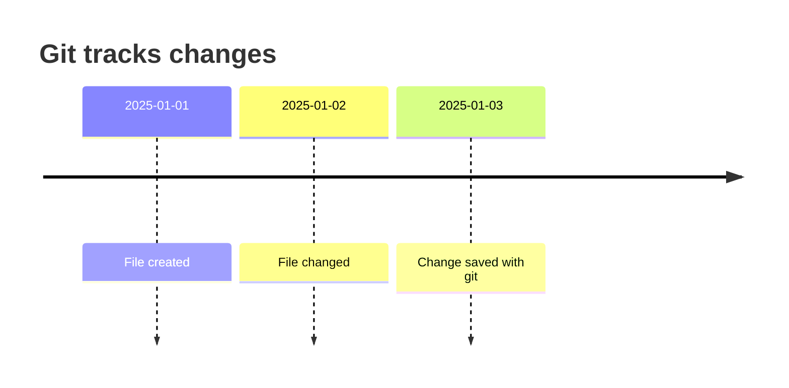

**Try it! Activity:**

- In your repo, add a `reflection.txt` that answers: “Why do you think Git is helpful?”

---

### Lesson 2.2: Installing Git

**Background:** To use Git, you need to install it on your computer. Download it from [https://git-scm.com/](https://git-scm.com/). After installation, you can use Git in the terminal.

**Diagram:**

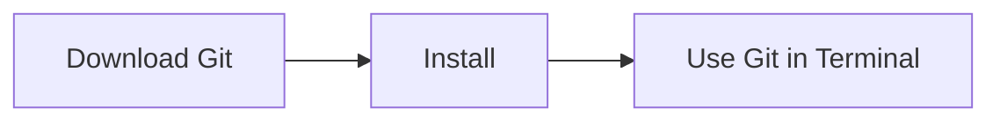

**Try it! Activity:**

- Install Git.
- In the terminal, type `git --version`.
- Add a file called `git_version.txt` to your repo with the version number.

---

### Lesson 2.3: Git init, status, add, commit (Local-only workflow)

**Background:**

- `git init` starts Git in your folder.
- `git status` checks which files changed.
- `git add` selects files to save.
- `git commit` saves changes with a message.

**Diagram:**

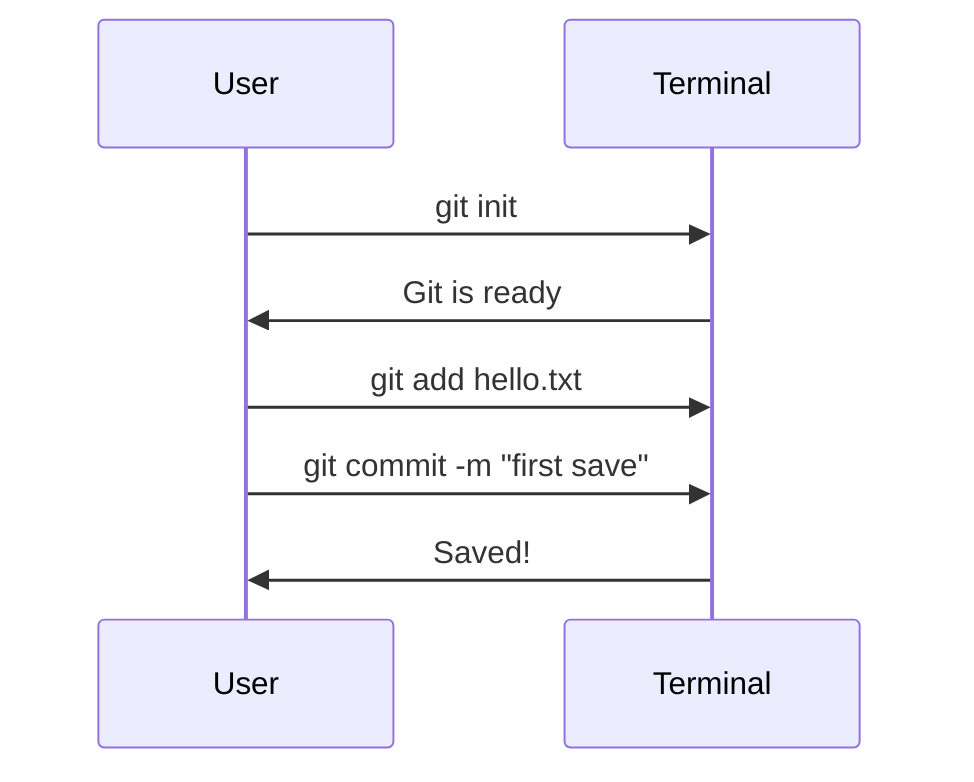

**Try it! Activity:**

- Go into your practice1 folder.
- In the terminal, type: `git init`
- Type: `git status`
- Type: `git add hello.txt`
- Type: `git commit -m "Add hello.txt"`
- Push your folder to your repo with a commit message.

---

### Lesson 2.4: Using Git to Track Changes in Simple Text Files

**Background:** Git watches files for changes and remembers every version. You can always see what you changed before.

**Diagram:**

```mermaid
graph LR
  A[hello.txt]-->|Change|B[git add]|-->|git commit|C[History]
```

**Try it! Activity:**

- Edit hello.txt and change the text.
- In the terminal, type: `git status`, `git add hello.txt`, `git commit -m "Update file"`
- Type: `git log` and copy the output to `git_log.txt`.
- Push updated files and `git_log.txt` to your repo.

---

### Lesson 2.5: Writing Commit Messages (Why They Matter)

**Background:** A commit message explains what you changed. Good messages help you and others remember your work.

**Diagram:**

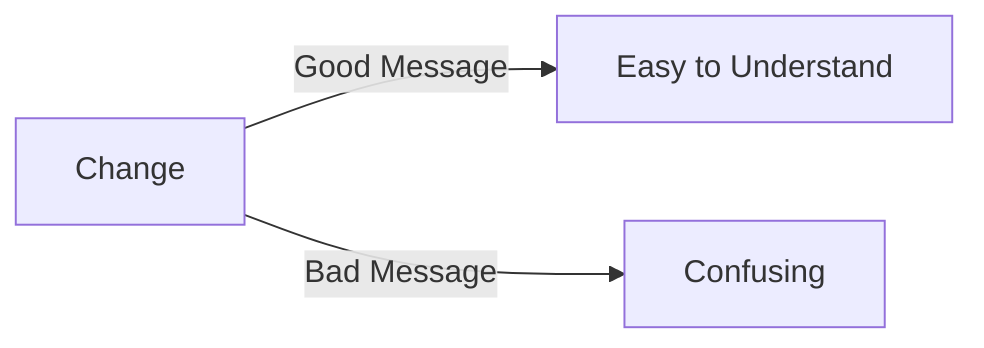

**Try it! Activity:**

- Each time you commit, write a message about what you changed.
- Add a file `commit_examples.txt` showing two of your commit messages.
- Push to your repo.

---

### Lesson 2.6: Practice: Track a Text Journal with Git

**Background:** Practice using Git every day. Make a file called `journal.txt`. Write one line per day. Add and commit your changes. Check your history.

**Try it! Activity:**

- Make a file `journal.txt`. Each day, add a new line and commit.
- Push `journal.txt` and ensure at least three commits are in your repo history.

---

## Week 3: GitHub and Cloud Syncing

### Lesson 3.1: Creating a GitHub Account

**Background:** GitHub is a website that lets you store and share your work. It keeps your files safe and lets you send them to others.

**Try it! Activity:**

- Go to [https://github.com](https://github.com), sign up for an account.
- Add a `github_username.txt` file to your repo with your username.

---

### Lesson 3.2: SSH Keys vs HTTPS (Intro + Simplified)

**Background:**

- HTTPS is like logging into a website. SSH is more secure but harder to set up.
- For now, use HTTPS to connect Git and GitHub.

**Try it! Activity:**

- Just keep using HTTPS! No deliverable for this lesson.

---

### Lesson 3.3: Cloning from GitHub Classroom (Step-by-step)

**Background:** Cloning means copying code from GitHub to your computer. You work on files locally and push changes back to GitHub.

**Try it! Activity:**

- Accept your GitHub Classroom assignment link.
- Click “Code” and copy the HTTPS address.
- In the terminal, type `git clone <paste-address-here>`
- Choose a folder for your code.
- Add `cloned.txt` with the words “I cloned the repo!” to your repo and push.

---

### Lesson 3.4: Pushing Local Repos to GitHub

**Background:** Pushing means sending your changes to GitHub. Now your work is saved online.

**Diagram:**

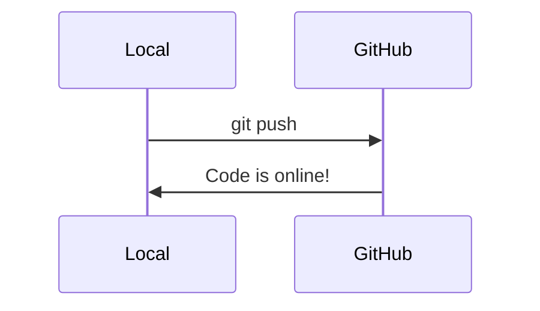

**Try it! Activity:**

- Edit a file, add and commit your change, then `git push`.
- Check your GitHub repo online to see the change.

---

### Lesson 3.5: GitHub Pages and Repo Structure

**Background:** A GitHub repo is like a project folder. It holds all your files, history, and sometimes a simple website.

**Diagram:**

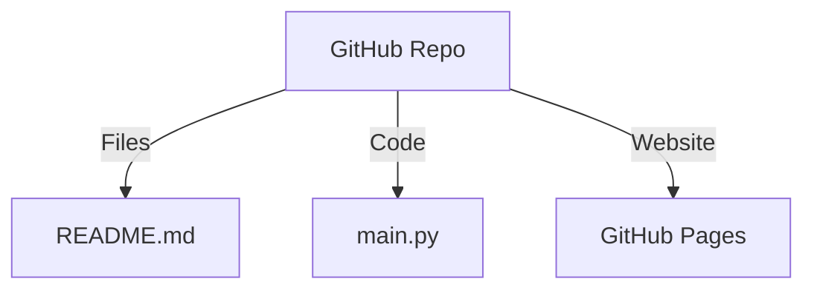

**Try it! Activity:**

- Open your repo online and look for the README.md file.
- Add `found_readme.txt` and write “Yes” if you found it, “No” if not.

---

### Lesson 3.6: Practice Assignment via GitHub Classroom

**Background:** GitHub Classroom helps teachers give out and collect code assignments. You will use it for most assignments.

**Try it! Activity:**

- Complete your first simple GitHub Classroom assignment (make or edit a file, push, confirm it is online).

---

## Week 4: Intro to Python Programming

### Lesson 4.1: Installing Python + VS Code

**Background:** Python is a programming language. VS Code is a code editor. You need both to write and run Python code. When installing Python, check the “Add to PATH” box so it works in the terminal.

**Try it! Activity:**

- Install Python and VS Code.
- In the terminal, type `python --version` (or `python3 --version`).
- Add `python_version.txt` to your repo with the version number.

---

### Lesson 4.2: Running Python in Terminal

**Background:** You can run Python code right in the terminal.

**Try it! Activity:**

- In the terminal, type `python` (or `python3`).
- Type: `print("Hello world!")`
- To exit, type `exit()`.
- Add a file `hello.py` with your print statement and push to your repo.

---

### Lesson 4.3: Writing Python with Print + Input

**Background:** Print shows a message. Input lets the user type something. Variables store the result.

**Diagram:**

```mermaid
flowchart TD
  Start --> Ask[Input: "What is your name?"] --> Show[Print: "Hello, <name>!"]
```

**Try it! Activity:**

- Write this Python code in a file called `first_program.py`:
  ```python
  name = input("What is your name? ")
  print("Hello,", name)
  ```
- Push `first_program.py` to your repo.

---

### Lesson 4.4: Variables and Strings

**Background:** Variables save information. A string is text.

**Try it! Activity:**

- Write code in `city_message.py`:
  ```python
  city = input("What city were you born in? ")
  print("I have heard", city, "is nice!")
  ```
- Push `city_message.py` to your repo.

---

### Lesson 4.5: Writing and Running Tests Manually

**Background:** A test checks if your code does what it should. You can write a simple test by calling your function and seeing if it gives the right answer.

**Try it! Activity:**

- Write a function, then make another file to test it using assert.
- Save test output in `test_results.txt`.
- Push your test file and `test_results.txt`.

---

### Lesson 4.6: Simple TDD with assert

**Background:** TDD (Test Driven Development) means writing tests before you write the code. Use `assert` in Python to check answers.

**Try it! Activity:**

- Create `add_function.py`:
  ```python
  def add(a, b):
      return a + b

  assert add(2, 3) == 5
  ```
- Push your file to your repo.

---

## Week 5: Building Programs with Logic

### Lesson 5.1: If/Else Statements

**Background:** If/else helps your program make choices.

**Try it! Activity:**

- Write `if_else.py`:
  ```python
  age = int(input("How old are you? "))
  if age >= 18:
      print("You are an adult.")
  else:
      print("You are a child.")
  ```
- Push to your repo.

---

### Lesson 5.2: Boolean Expressions

**Background:** A Boolean is True or False. It helps your program make decisions.

**Try it! Activity:**

- Write `boolean_example.py`:
  ```python
  is_hot = True
  if is_hot:
      print("It is hot today!")
  ```
- Push to your repo.

---

### Lesson 5.3: Loops (For + While)

**Background:** A loop repeats something many times.

**Try it! Activity:**

- Write `loop_example.py`:
  ```python
  for i in range(3):
      print("This is loop number", i)
  ```
- Push to your repo.

---

### Lesson 5.4: Lists and Dictionaries

**Background:** A list holds many values. A dictionary holds key-value pairs.

**Try it! Activity:**

- Write `lists_dicts.py`:
  ```python
  my_list = [1, 2, 3]
  my_dict = {"name": "Alice", "age": 21}
  print(my_list[0])
  print(my_dict["name"])
  ```
- Push to your repo.

---

### Lesson 5.5: Writing Pytest Files by Hand

**Background:** Pytest is a tool for testing code. You write test files and run them in the terminal.

**Try it! Activity:**

- Make a test file:
  ```python
  def test_add():
      assert add(1, 2) == 3
  ```
- Run `pip install pytest` and `pytest` in the terminal.
- Push your test file to your repo.

---

### Lesson 5.6: Practice Project: Mini Quiz Game with Test File

**Background:** Build a small quiz program and write a test for it.

